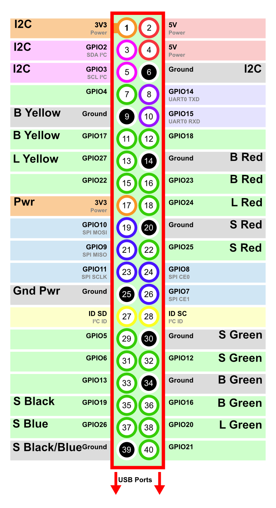
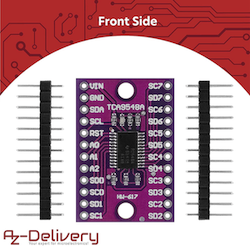
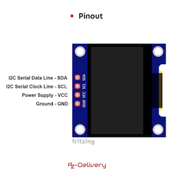
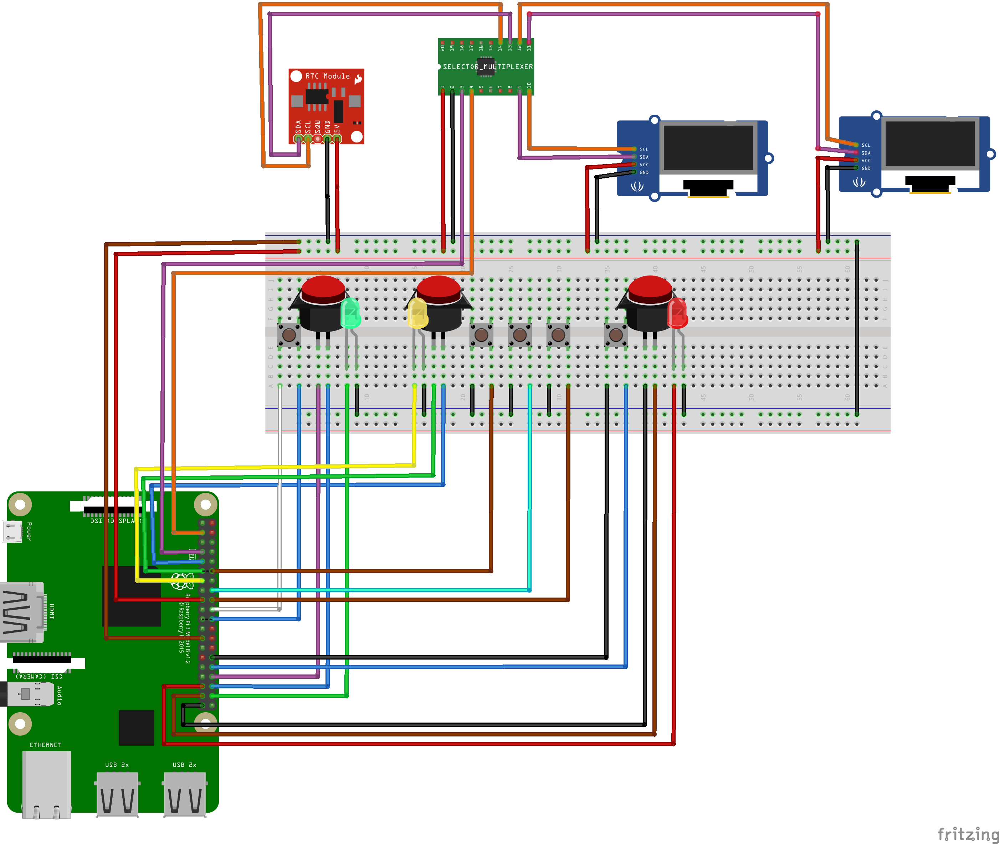

# ScrabScrap v2 Hardware-Installation

## Teileliste

* Raspberry PI 3
* [Raspberry PI Camera (AZDelivery Kamera für Raspberry Pi) v1.3](https://www.amazon.de/AZDelivery-Kamera-Flexkabel-Raspberry-Gratis/dp/B07KSZW251)
* Anschluss-Kabel Raspberry PI Camera
* [Button mit LED Grün/Gelb/Rot (EG STARTS 10x neue LED beleuchtet Arcade-Tasten mit Mikroschalter Mame Multicade)](https://www.amazon.de/gp/product/B01N549IDL)
* Schalter Grün
* Schalter Rot
* Schalter Gelb, Schwarz, Blau
* [Multiplexer I2C (AZDelivery PCA9548A I2C Multiplexer 8-Kanal-Multiplexer)](https://www.amazon.de/AZDelivery-TCA9548A-Multiplexer-8-Kanal-Multiplexer-kompatibel/dp/B086W7SL63)
* [2 * Display (AZDelivery 5 x 0,96 Zoll OLED Display I2C SSD1306 Chip 128 x 64 Pixel)](https://www.amazon.de/AZDelivery-Display-Arduino-Raspberry-Gratis/dp/B074NJMPYJ)
* [RTC (AZDelivery Real Time Clock RTC DS3231 I2C)](https://www.amazon.de/AZDelivery-RTC-Batterie-inklusive-Arduino/dp/B01M2B7HQB)
* Kabel & Stecker

\pagebreak

## Anschluss an die Raspberry PI GPIO

* Button Gelb mit LED  
  PIN 9, 11, 13 (GPIO Gnd, 17, 27)
* Button Rot mit LED  
  PIN 35, 37, 39 (GPIO 19, 26, Gnd)
* Button Grün mit LED  
  PIN 34, 36, 38 (GPIO Gnd, 16, 20)
* Switch Rot  
  PIN 30, 32 (GPIO Gnd, 12)
* Switch Grün  
  PIN 20, 22 (GPIO Gnd, 25)
* Switch Gelb  
  PIN 18, 14 (GPIO Gnd, 24)
* Switch Blau  
  PIN 16, 14 (GPIO Gnd, 23)
* Switch Schwarz  
  PIN 12, 14 (GPIO Gnd, 18)
* Stromversorgung: ein Anschuß wird gegabelt auf 4 Anschlüsse  
  PIN 17, 25 (GPIO Gnd, 3V3)
* I2C Multiplexer  
  PIN 1, 3, 5, 6 (GPIO 3V3, 2, 3, Gnd)

__Hinweis__ Die eingebauten LEDs der Button benötigen keinen Vorwiderstand. Werden diese ersetzt,
so müssen geeignete Vorwiderstände ergänzt werden.

\pagebreak

## Anschluss an den Muliplexer

| Multiplexer                                  | OLED                             |
|----------------------------------------------|----------------------------------|
|    |  |

### Anschluss Raspberry PI an Multiplexer

| Raspberry PI       | Multiplex |
|--------------------|-----------|
| PIN 1 (GPIO 3V3)   | VCC       |
| PIN 3 (GPIO 2/SDA) | SDA       |
| PIN 5 (GPIO 3/SCL) | SCL       |
| PIN 6 (GPIO Gnd)   | Gnd       |

### Anschluss OLED (Display 1 - Grün) an Multiplexer

| OLED | Raspberry PI          | Multiplex |
|------|-----------------------|-----------|
| SDA  |                       | SD0       |
| SCL  |                       | SC0       |
| VCC  | RPI PIN 17 (GPIO 3V3) |           |
| Gnd  | RPI PIN 25 (GPIO Gnd) |           |

### Anschluss OLED (Display 2 - Rot) an Multiplexer

| OLED | Raspberry PI          | Multiplex |
|------|-----------------------|-----------|
| SDA  |                       | SD1       |
| SCL  |                       | SC1       |
| VCC  | RPI PIN 17 (GPIO 3V3) |           |
| Gnd  | RPI PIN 25 (GPIO Gnd) |           |

### Anschluss RTC an Multiplexer

| OLED | Raspberry PI          | Multiplex |
|------|-----------------------|-----------|
| SDA  |                       | SD2       |
| SCL  |                       | SC2       |
| VCC  | RPI PIN 17 (GPIO 3V3) |           |
| Gnd  | RPI PIN 25 (GPIO Gnd) |           |

## Schaltplan

## Kamera

### Kamera-Anschluss

Kamera-Anschluss (Bild-Quelle: raspberrypi.com)

Das Flachbandkabel für die Kamera wird in einer Klemmschiene befestigt.
Hierzu die Klemmschiene vom Anschluss abziehen und das Flachbandkabel
vorsichtig reinschieben. Beim Flachbandkabel bitte vorher sicherstellen,
dass die Kontaktstreifen nicht beschädigt oder verbogen sind. In diesem
Fall das Flachbandkabel austauschen.

Die blaue Markierung muss beim Einbau in Richtung Klemmschiene zeigen.

### Aufbau des Kamera-Arms

Mit der unteren Inbus Schraube (1; HX5) den Kamera-Arm am Spielbrett befestigen.
Die mittlere Schraube (2; HX5) kann zur Höheneinstellung verwendet werden. Mit der
RPI Kamera v1.3 sollte sich die Kamera-Linse ca. 47,5cm über dem Spielbrett
befinden. Eine Feineinstellung und Rotation der Kamera kann direkt am Kamera-
Halter (3; HX5) vorgenommen werden.

