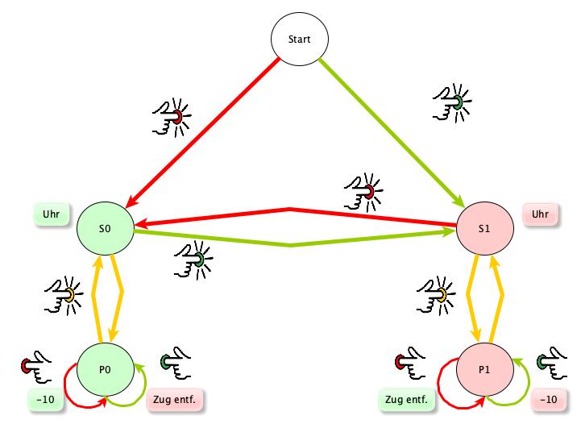

## ScrabScrap - Player 1 (Green)

### Play

|                                      |                                          |
|--------------------------------------|------------------------------------------|
|  |   |
| Lay move                             | Button Green                             |

### Pause

|                                           |                                           |
|-------------------------------------------|-------------------------------------------|
|  |  |
| Button yellow                             | Button Yellow                             |
| Pause                                     | Continue game                             |

### Doubt (I am right)

|                                           |                                                 |                                           |
|-------------------------------------------|-------------------------------------------------|-------------------------------------------|
|  |   |  |
| Button Yellow                             | **Switch** Green \*                             | Button Yellow                             |
| Pause                                     | Display player "red": Zug Entf.                 | Continue game                             |

> \* if doubting is no longer possible, "Timeout" is shown in the display of player "green"

### Doubt (I am wrong)

|                                           |                                              |                                           |
|-------------------------------------------|----------------------------------------------|-------------------------------------------|
|  |    |  |
| Button Yellow                             | **switch** Red \*                            | Button Yellow                             |
| Pause                                     | Display player "green": -10 Pkt.             | Continue game                             |

> \* if doubting is no longer possible, "Timeout" is shown in the display of player "green"

### I did not press my play button after the turn

1. yellow button: Pause
2. remove opponent's pieces from the board
3. yellow button: End pause
4. green button: Move is analysed
5. place the opponent's pieces (red) back on the board
6. red button: Opponent's move is analysed
7. it is green's turn again

> Player 1 (green) loses the opponent's thinking time

\pagebreak

## ScrabScrap - Player 2 (Red)

### Play

|                                       |                                       |
|---------------------------------------|---------------------------------------|
|   |    |
| Lay move                              | Button Red                            |

### Pause

|                                           |                                           |
|-------------------------------------------|-------------------------------------------|
|  |  |
| Button Yellow                             | Button Yellow                             |
| Pause                                     | Continue game                             |

### Doubt (I am right)

|                                           |                                              |                                           |
|-------------------------------------------|----------------------------------------------|-------------------------------------------|
|  |    |  |
| Button Yellow                             | **Switch** Red \*                            | Button Yellow                             |
| Pause                                     | Display player "green": Zug Entf             | Continue game                             |

> \* if doubting is no longer possible, "Timeout" is shown in the display of player "red"

### Doubt (I am wrong)

|                                           |                                                 |                                           |
|-------------------------------------------|-------------------------------------------------|-------------------------------------------|
|  |   |  |
| Button Yellow                             | **Switch** Green \*                             | Button Yellow                             |
| Pause                                     | Display player "red": -10 Pkt.                  | Continue game                             |

> \* if doubting is no longer possible, "Timeout" is shown in the display of player "red"

### I did not press my play button after the turn

1. yellow button: Pause
2. remove opponent's pieces from the board
3. yellow button: End pause
4. red button: Move is analysed
5. place the opponent's pieces (green) back on the board
6. green button: Opponent's move is analysed
7. it is red's turn again

> Player 2 (red) loses the opponent's thinking time

\pagebreak

## Start of a game

## Preparations

Before the game, the camera should be aligned. If this camera position is
stored, this increases the stability of the image recognition, as the playing field does not have
to be determined every time it is called up. This can be done by the internal web server of
ScrabScrap comfortably in the browser.

If desired, the player names can be set in the web application.

The game can be started when both displays show the respective player names.

### Green should start

  
Button Red

### Red should start

  
Button Green

# End of the game

First make sure that the game is paused. That is, the yellow LED is lit.
To end and archive a game, the **"End "** button must be pressed for more than
than 3 seconds. The current score appears in the displays
and the yellow button flashes.

A new game can be started by pressing any button. The
"Name1" and "Name2" appears in the display.

_Note:_ It may take a moment to load the entire game, including all pictures, into a ZIP file.
including all pictures is saved in a ZIP file. This file will be uploaded to the web server.

# The calculator no longer responds

If the calculator no longer responds to the pressing of the coloured
buttons, or if the displays do not show the correct time for several moves
over several moves, a software error has probably occurred. In this case, the
entire system can be restarted by pressing the **Switch "Boot "** for more
than 3 seconds.

_Note:_ In this case all unsaved data will be lost and
the current game can no longer be continued.

\pagebreak

# Quick-Reference - ScrabScrap

## Basic preliminary remark

The application is based on taking a photo of the board at certain times and then
board at certain points in time and then analysing it. In order for this to work
players must take care not to cover the board when the button is pressed.

## Doubting

If doubting is still possible, "!?" is shown in the active player's display.
The right side of the display also shows the duration of the current move in seconds.

## Further buttons

There are five further buttons behind the three larger buttons.

* Green/Red: button for doubting the move  
  (single press)
* Yellow/Black/Blue: Button for access point, end of game, reboot
  (hold for more than 3s)

The function of the button is labelled in each case.

## General notes

The application is designed to continue running even in the event of an error.
Only the non-functioning parts of the application are deactivated. This has the
consequence that dependent parts will also no longer function correctly. Thus no
board can be calculated if the camera can no longer take correct pictures.

\pagebreak

## State diagram

