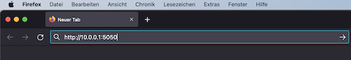
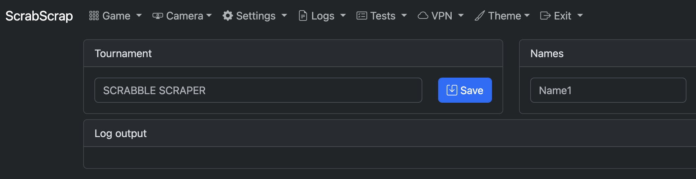
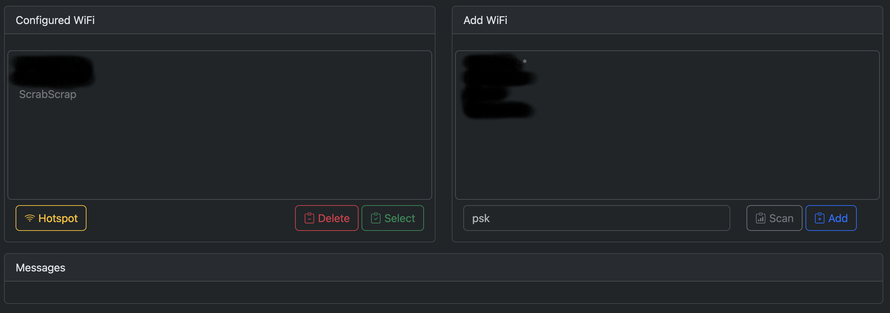

---
output:
  pdf_document:
    path: pdf/manual-wlan-de.pdf
    highlight: tango
geometry: margin=2cm
---

# Konfiguration der WLAN Einträge

## Neues WLAN hinzufügen

Wenn ScrabScrap kein bekanntes WLAN findet, wird ein Access Point geöffnet. Das WLAN trägt den Namen
`ScrabScrap`. Um ein neues WLAN hinzuzufügen müssen folgende Schritte durchgeführt werden:

1. Verbinden des lokalen Rechners mit dem WLAN `ScrabScrap` (das Default-Kennwort ist `scrabscrap`)
2. Im Browser auf die URL `http://10.0.0.1:5050` navigieren  
  
3. Es wird die Konfigurationsseite von ScrabScrap angezeigt  
  
4. Den Menüeintrag "WiFi" auswählen  
    
  Dort kann ein `Scan` durchgeführt werden, um die erreichbaren WLANs anzuzeigen.
  Eventuell muss der Scan häufiger angestoßen werden, falls nicht sofort die gewünschten WLANs angezeigt werden.
5. In die Eingabefelder die SSID und das Kennwort des WLANs eintragen und mit "Add" bestätigen.

## WLAN Eintrag löschen

Es können WLAN Konfigurationen gelöscht werden. Hierzu im Bereich "Delete configured WiFi" das zu löschende
WLAN auswählen und über die Schaltfläche "Delete" löschen.

_Hinweis:_ das aktuell verbundene und die vorkonfigurierten WLANs können nicht ausgewählt werden.

## WLAN wechseln

Stehen mehere WLANs zur Verfügung, wird das WLAN mit dem stärksten Empfang ausgewählt. Soll ein anderes verwendet werden, kann dies in dem Bereich "Select configured WiFi" gewählt werden. Das ausgewählte
WLAN wird sofort aktiviert.

_Hinweis:_ das aktuell verbundene kann nicht ausgewählt werden.
