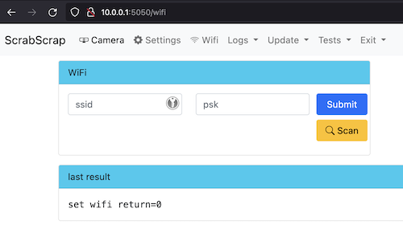

# Konfiguration der WLAN Einträge

## Neues WLAN hinzufügen

Wenn ScrabScrap kein bekanntes WLAN findet, wird ein Access Point geöffnet. Das WLAN trägt den Namen
`ScrabScrap`. Um ein neues WLAN hinzuzufügen müssen folgende Schritte durchgeführt werden:

1. Verbinden des lokalen Rechners mit dem WLAN `ScrabScrap` (das Default-Kennwort ist `scrabscrap`)
2. Im Browser auf die URL `http://10.0.0.1:5050` navigieren  
  
3. Es wird die Konfigurationsseite von ScrabScrap angezeigt  
  
4. Den Menüeintrag "WiFi" auswählen  
    
  Dort kann ein `Scan` durchgeführt werden, um die erreichbaren WLANs anzuzeigen.
  Eventuell muss der Scan häufiger angestoßen werden, falls nicht sofort die gewünschten WLANs angezeigt werden.
5. In die Eigabefelder die SSID und das Kennwort des WLANs eintragen.
  Nach dem `Submit` der Daten sollte im Log `return=0` angezeigt werden.  
  
6. Der ScrabScrap Rechner muss über das Menü `Exit -> Reboot` neu gestartet werden.
  Nach dem Neustart sollte das neue WLAN gefunden und verbunden werden.

## WLAN Eintrag löschen

TODO - z.Zt. noch nicht implementiert
